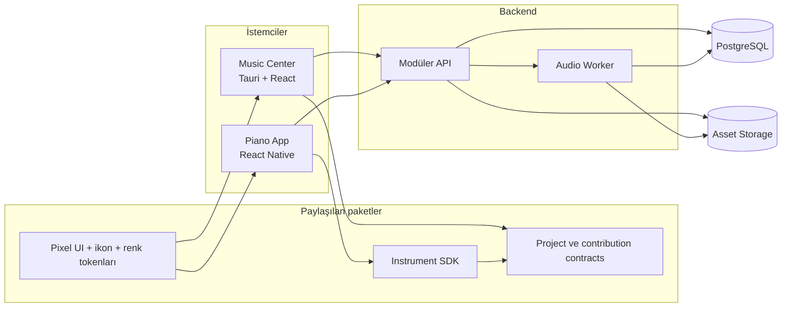
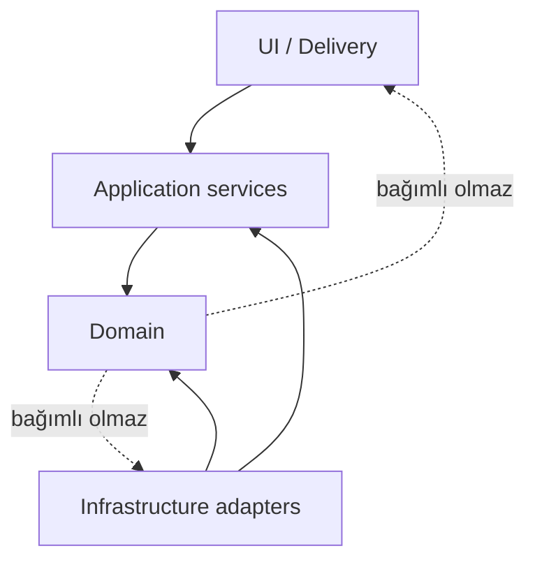

# Sistem mimarisi

Durum: Öneri

## Mimari stil

MVP, monorepo içinde **modüler monolit + ayrı audio worker** olarak kurulacaktır. Domain sınırları kod paketleriyle korunacak; ihtiyaç oluşmadan mikroservise ayrılmayacaktır.



## Monorepo hedef yapısı

```text
stemweave/
├── apps/
│   ├── center-desktop/
│   └── piano-mobile/
├── services/
│   ├── api/
│   └── audio-worker/
├── packages/
│   ├── contracts/
│   ├── domain/
│   ├── instrument-sdk/
│   ├── pixel-ui/
│   ├── instrument-catalog/
│   ├── audio-model/
│   ├── config/
│   └── test-kit/
├── infrastructure/
│   └── docker/
├── docs/
└── .github/
```

## Modül bağımlılık kuralı



Domain katmanı Tauri, React, Fastify, PostgreSQL veya FFmpeg bilmemelidir.

## Paylaşılan sözleşmeler

### ProjectManifest

```ts
type ProjectManifest = {
  projectId: string;
  ruleVersionId: string;
  bpm: number;
  timeSignature: { numerator: number; denominator: number };
  keySignature?: string;
  sampleRateHz: 48000;
  tuningHz: 440;
  countInBars: number;
  ticksPerQuarter: 960;
};
```

### ContributionManifest

```ts
type ContributionManifest = {
  contributionId: string;
  projectId: string;
  ruleVersionId: string;
  instrumentId: string;
  recordedBy: string;
  recordedBpm: number;
  startTick: number;
  durationTicks: number;
  takeNumber: number;
  assets: Array<{
    kind: "midi-events" | "source-audio" | "preview-audio";
    checksumSha256: string;
    mimeType: string;
  }>;
};
```

Sözleşmeler Zod ile runtime’da doğrulanır ve OpenAPI/JSON Schema üretimine kaynak olur.

## Music Center sınırları

- Proje seçimi ve kuralları
- Gelen katkılar
- Track/timeline düzenleme
- Marker ve transport
- Review ve A/B karşılaştırma
- Render işi oluşturma
- Focus mode ve panel kısayolları

Center doğrudan veritabanına bağlanmaz; API kullanır. Yerel dosya seçimi gibi işletim sistemi yetenekleri Tauri command izinleri üzerinden yürür.

## Enstrüman SDK sınırları

- Projeye bağlanma
- ProjectManifest alma ve cache etme
- Renk/ikon tanımını alma
- Katkı metadata’sı üretme
- Upload lifecycle
- Tempo change request
- Ortak hata kodları

Enstrümanın ses motoru SDK’nın parçası değildir; `InstrumentAudioEngine` arayüzüne bağlanır.

## Zaman modeli

- Veri tabanında klip başlangıcı `start_tick` olarak saklanır.
- MVP `ticks_per_quarter = 960` kullanır.
- Piksel konumu yalnızca UI hesaplamasıdır.
- Audio dosyasının örnek sayısı ve sample rate’i ayrıca tutulur.
- Project rule version, katkının hangi BPM/ölçü altında kaydedildiğini kanıtlar.

## Asset güvenlik modeli

1. API upload oturumu oluşturur.
2. İstemci dosyayı storage adapter’a gönderir.
3. Checksum doğrulanır.
4. Worker teknik metadata çıkarır.
5. Asset `READY` olmadan timeline’da merge edilemez.

## Gelecekte ayrılabilecek modüller

- Audio worker
- Notification delivery
- Public playback/catalog
- Realtime collaboration

Bu ayrım ancak ölçüm ve ekip sahipliği gerektirirse yapılacaktır.
