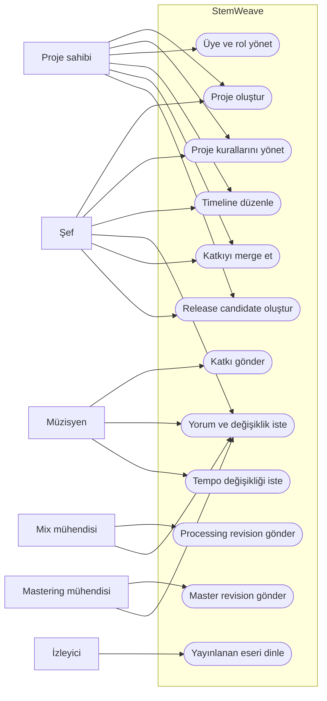
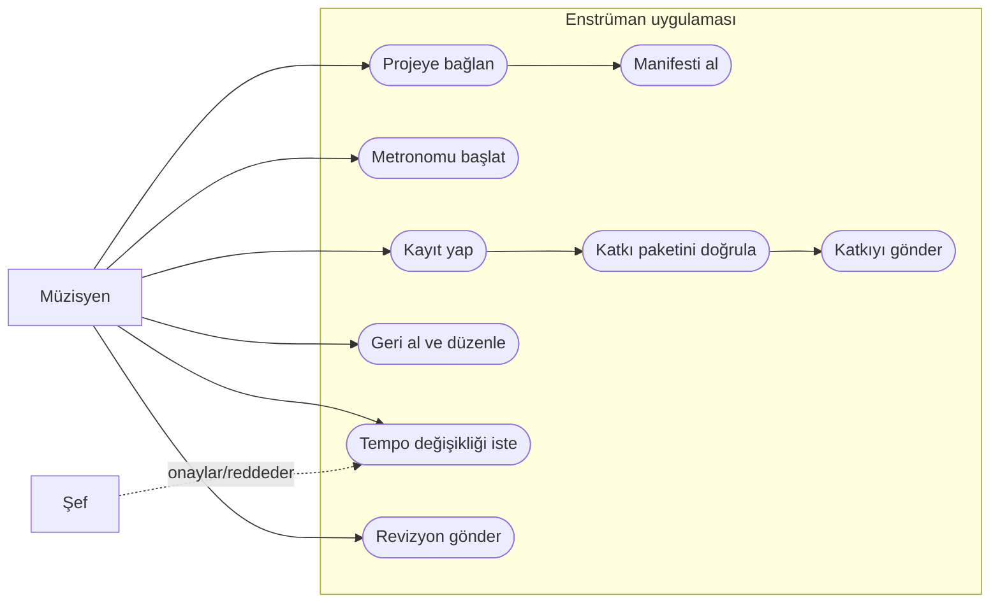
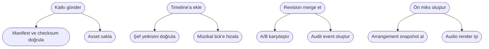

# Use case diyagramları

Durum: Öneri

Mermaid doğrudan UML use-case ovali sağlamadığı için use case’ler aktör–eylem bağlantılarıyla gösterilmiştir.

## Music Center

## Enstrüman uygulaması

## Include/extend ilişkileri

