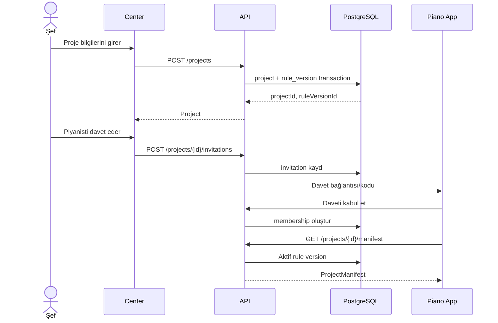
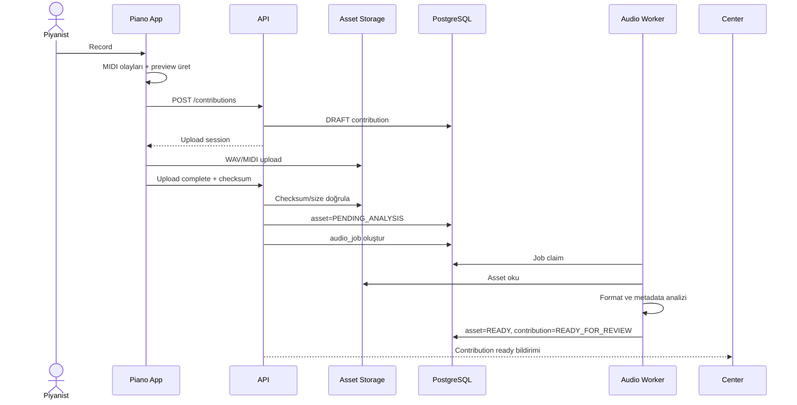
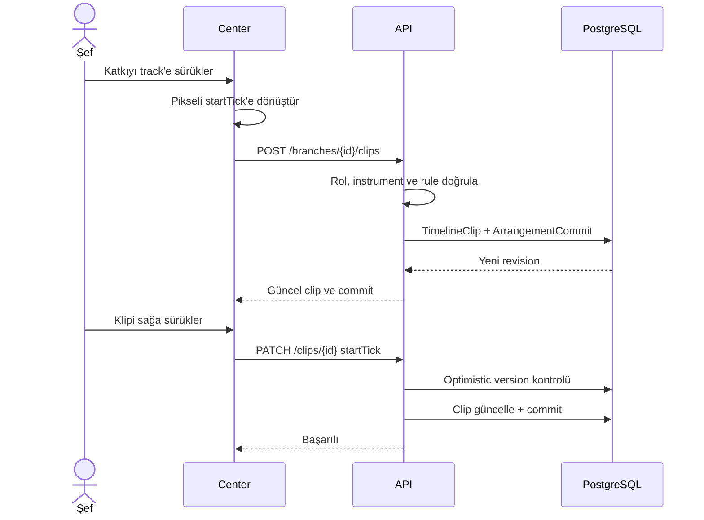
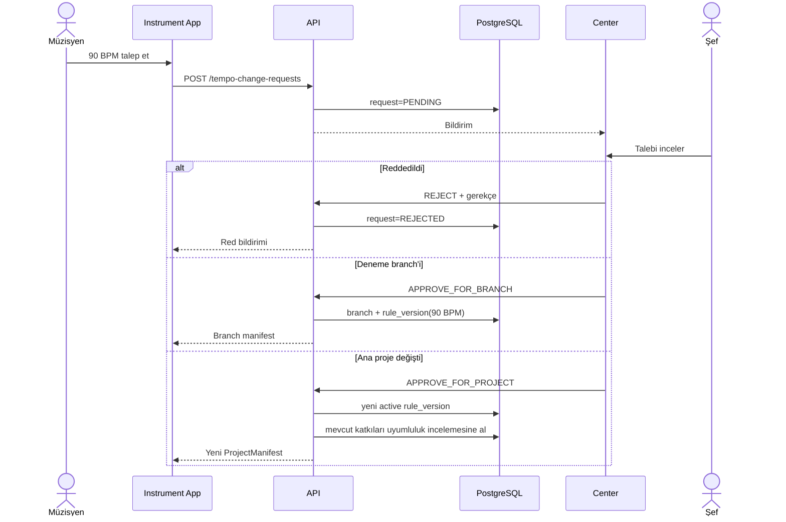
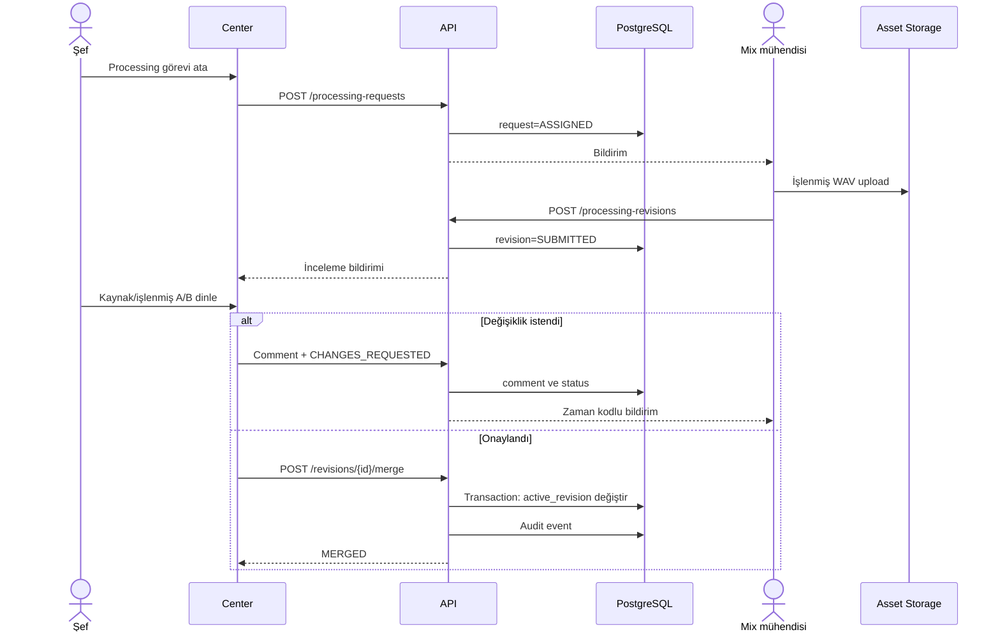
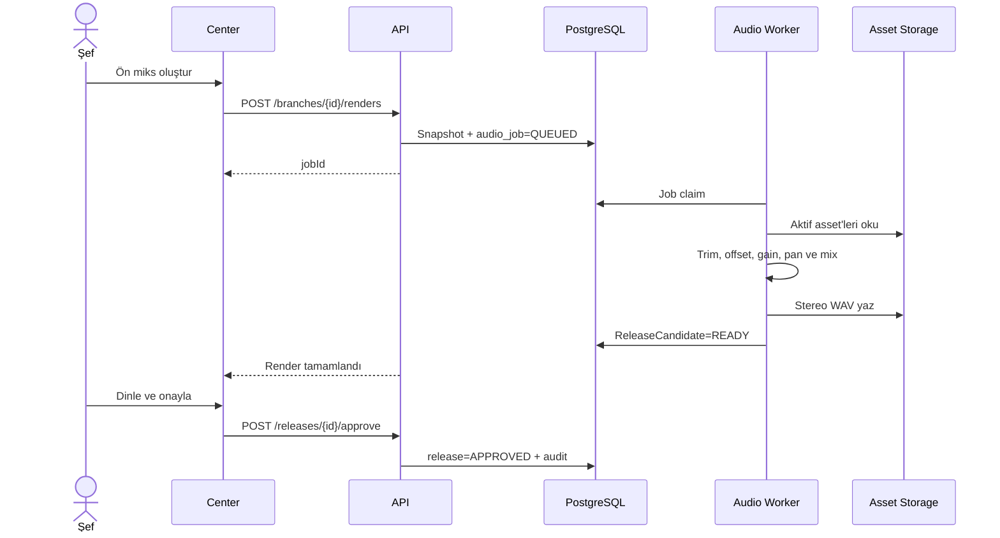

# Sequence diyagramları

Durum: Öneri

## Proje oluşturma ve manifest alma

## Piyano kaydı ve upload

## Timeline’a yerleştirme ve taşıma

## Tempo değişiklik isteği

## Processing revision ve merge

## Render ve release candidate

