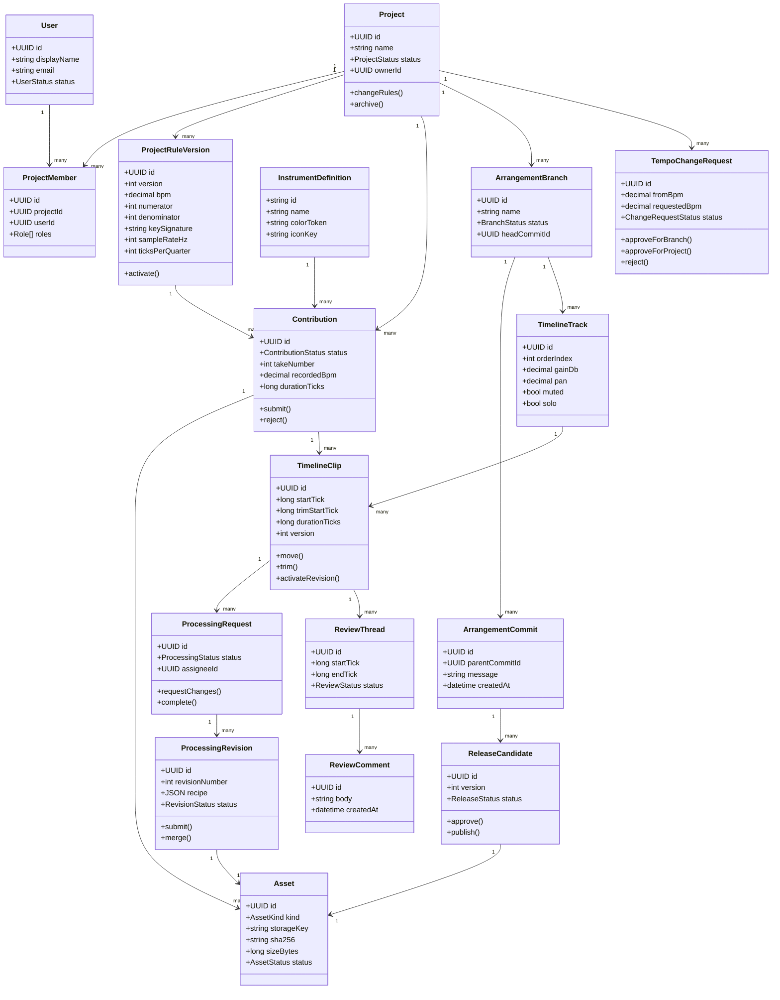

# Domain sınıf diyagramı

Durum: Öneri

## Aggregate sınırları

- **Project aggregate:** Project, ProjectRuleVersion ve üyelik politikaları
- **Contribution aggregate:** Contribution ve kaynak asset bağlantıları
- **Arrangement aggregate:** Branch, commit, track ve clip
- **Processing aggregate:** ProcessingRequest ve ProcessingRevision
- **Review aggregate:** ReviewThread ve ReviewComment
- **Release aggregate:** ReleaseCandidate ve çıktı asset’i

Aggregate’ler birbirine nesne referansı yerine kimlik üzerinden bağlanır. Transaction sınırı aggregate sınırını geçmemelidir; merge gibi koordinasyonlar application service tarafından yürütülür.
