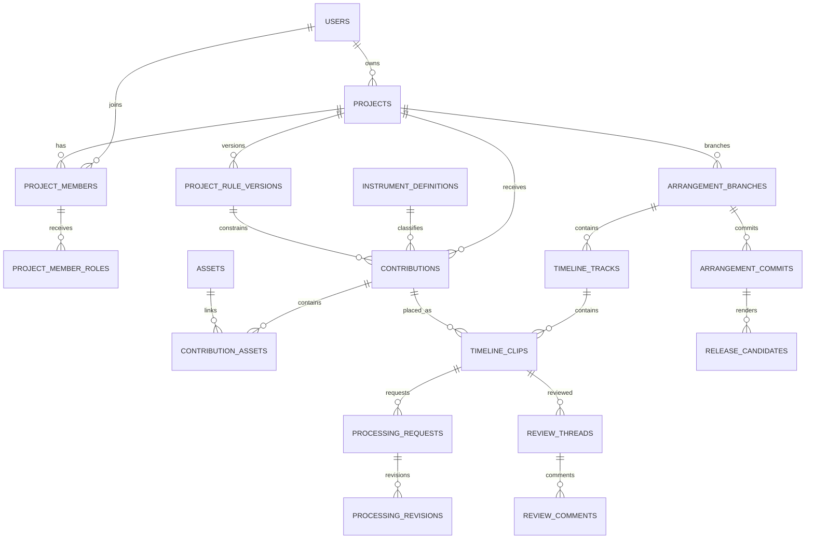

# PostgreSQL veritabanı şeması

Durum: Öneri

## Kurallar

- Kimlikler `uuid` ve uygulama tarafında üretilir.
- Zamanlar `timestamptz` ve UTC saklanır.
- BPM `numeric(6,3)` kullanır.
- Müzikal konumlar `bigint` tick olarak saklanır.
- Durum alanları PostgreSQL enum yerine `text + check constraint` kullanır; migration daha kolaydır.
- Ses binary içeriği veritabanında tutulmaz.
- Silinebilen kullanıcı içeriklerinde `deleted_at` ile soft-delete uygulanır.
- Metadata JSONB kullanılsa bile temel sorgu alanları normal kolonlarda kalır.

## İlişki özeti

## Kimlik ve üyelik tabloları

### `users`

| Kolon          | Tip            |  Null | Açıklama                          |
| -------------- | -------------- | ----: | --------------------------------- |
| `id`           | `uuid`         | Hayır | Primary key                       |
| `email`        | `citext`       | Hayır | Unique, normalize edilmiş e-posta |
| `display_name` | `varchar(120)` | Hayır | Görünen ad                        |
| `avatar_url`   | `text`         |  Evet | Profil görseli                    |
| `status`       | `text`         | Hayır | `ACTIVE`, `SUSPENDED`, `DELETED`  |
| `created_at`   | `timestamptz`  | Hayır | Oluşturma zamanı                  |
| `updated_at`   | `timestamptz`  | Hayır | Güncelleme zamanı                 |
| `deleted_at`   | `timestamptz`  |  Evet | Soft-delete                       |

İndeksler: unique `lower(email)`; `status`.

### `projects`

| Kolon                    | Tip            |  Null | Açıklama                                        |
| ------------------------ | -------------- | ----: | ----------------------------------------------- |
| `id`                     | `uuid`         | Hayır | Primary key                                     |
| `owner_user_id`          | `uuid`         | Hayır | FK `users.id`                                   |
| `name`                   | `varchar(160)` | Hayır | Proje adı                                       |
| `slug`                   | `varchar(180)` | Hayır | Sahip kapsamında unique                         |
| `description`            | `text`         |  Evet | Sanatsal brief                                  |
| `status`                 | `text`         | Hayır | `DRAFT`, `ACTIVE`, `ARCHIVED`                   |
| `active_rule_version_id` | `uuid`         |  Evet | FK rule version; ilk transaction sonunda atanır |
| `created_at`             | `timestamptz`  | Hayır | Oluşturma                                       |
| `updated_at`             | `timestamptz`  | Hayır | Güncelleme                                      |
| `archived_at`            | `timestamptz`  |  Evet | Arşiv zamanı                                    |

İndeksler: unique `(owner_user_id, slug)`; `(status, updated_at desc)`.

### `project_members`

| Kolon                | Tip           |  Null | Açıklama                       |
| -------------------- | ------------- | ----: | ------------------------------ |
| `id`                 | `uuid`        | Hayır | Primary key                    |
| `project_id`         | `uuid`        | Hayır | FK `projects.id`               |
| `user_id`            | `uuid`        | Hayır | FK `users.id`                  |
| `membership_status`  | `text`        | Hayır | `INVITED`, `ACTIVE`, `REMOVED` |
| `invited_by_user_id` | `uuid`        |  Evet | FK `users.id`                  |
| `joined_at`          | `timestamptz` |  Evet | Katılım zamanı                 |
| `created_at`         | `timestamptz` | Hayır | Oluşturma                      |
| `updated_at`         | `timestamptz` | Hayır | Güncelleme                     |

İndeksler: unique `(project_id, user_id)`; `(user_id, membership_status)`.

### `project_member_roles`

| Kolon                | Tip           |  Null | Açıklama                                                                         |
| -------------------- | ------------- | ----: | -------------------------------------------------------------------------------- |
| `project_member_id`  | `uuid`        | Hayır | FK `project_members.id`                                                          |
| `role`               | `text`        | Hayır | `OWNER`, `CONDUCTOR`, `MUSICIAN`, `MIX_ENGINEER`, `MASTERING_ENGINEER`, `VIEWER` |
| `granted_by_user_id` | `uuid`        | Hayır | FK `users.id`                                                                    |
| `created_at`         | `timestamptz` | Hayır | Verilme zamanı                                                                   |

Primary key: `(project_member_id, role)`.

### `project_member_instruments`

| Kolon               | Tip           |  Null | Açıklama                       |
| ------------------- | ------------- | ----: | ------------------------------ |
| `project_member_id` | `uuid`        | Hayır | FK `project_members.id`        |
| `instrument_id`     | `varchar(50)` | Hayır | FK `instrument_definitions.id` |
| `created_at`        | `timestamptz` | Hayır | Atama zamanı                   |

Primary key: `(project_member_id, instrument_id)`.

### `project_invitations`

| Kolon                | Tip            |  Null | Açıklama             |
| -------------------- | -------------- | ----: | -------------------- |
| `id`                 | `uuid`         | Hayır | Primary key          |
| `project_id`         | `uuid`         | Hayır | FK `projects.id`     |
| `email`              | `citext`       | Hayır | Davet edilen e-posta |
| `token_hash`         | `varchar(128)` | Hayır | Ham token saklanmaz  |
| `roles`              | `text[]`       | Hayır | Başlangıç rolleri    |
| `expires_at`         | `timestamptz`  | Hayır | Son kullanım         |
| `accepted_at`        | `timestamptz`  |  Evet | Kabul zamanı         |
| `created_by_user_id` | `uuid`         | Hayır | Davet eden           |
| `created_at`         | `timestamptz`  | Hayır | Oluşturma            |

İndeksler: unique `token_hash`; `(project_id, email)`.

## Proje kuralı ve enstrüman tabloları

### `project_rule_versions`

| Kolon                        | Tip            |  Null | Açıklama              |
| ---------------------------- | -------------- | ----: | --------------------- |
| `id`                         | `uuid`         | Hayır | Primary key           |
| `project_id`                 | `uuid`         | Hayır | FK `projects.id`      |
| `version_number`             | `integer`      | Hayır | Proje içinde artan    |
| `bpm`                        | `numeric(6,3)` | Hayır | 30–300                |
| `time_signature_numerator`   | `smallint`     | Hayır | 3, 4 veya 6 MVP       |
| `time_signature_denominator` | `smallint`     | Hayır | 4 veya 8 MVP          |
| `key_signature`              | `varchar(20)`  |  Evet | Örn. `C_MAJOR`        |
| `sample_rate_hz`             | `integer`      | Hayır | MVP 48000             |
| `tuning_hz`                  | `numeric(6,2)` | Hayır | Varsayılan 440.00     |
| `ticks_per_quarter`          | `integer`      | Hayır | MVP 960               |
| `count_in_bars`              | `smallint`     | Hayır | Varsayılan 1          |
| `change_reason`              | `text`         |  Evet | Değişiklik açıklaması |
| `created_by_user_id`         | `uuid`         | Hayır | FK `users.id`         |
| `created_at`                 | `timestamptz`  | Hayır | Oluşturma             |

İndeksler: unique `(project_id, version_number)`.

### `instrument_definitions`

| Kolon          | Tip           |  Null | Açıklama                                         |
| -------------- | ------------- | ----: | ------------------------------------------------ |
| `id`           | `varchar(50)` | Hayır | `piano`, `cello`, `guitar` gibi PK               |
| `display_name` | `varchar(80)` | Hayır | Kullanıcı adı                                    |
| `family`       | `varchar(50)` | Hayır | `KEYS`, `STRINGS`, `PERCUSSION`, `BRASS`, `WIND` |
| `color_hex`    | `char(7)`     | Hayır | Enstrüman ana rengi                              |
| `icon_key`     | `varchar(80)` | Hayır | Pixel ikon kimliği                               |
| `sort_order`   | `smallint`    | Hayır | Katalog sırası                                   |
| `enabled`      | `boolean`     | Hayır | Kullanılabilirlik                                |
| `metadata`     | `jsonb`       | Hayır | Doğrulanan ek özellikler                         |
| `updated_at`   | `timestamptz` | Hayır | Güncelleme                                       |

## Asset ve katkı tabloları

### `assets`

| Kolon                | Tip            |  Null | Açıklama                                                                           |
| -------------------- | -------------- | ----: | ---------------------------------------------------------------------------------- |
| `id`                 | `uuid`         | Hayır | Primary key                                                                        |
| `project_id`         | `uuid`         | Hayır | Erişim kapsamı                                                                     |
| `kind`               | `text`         | Hayır | `SOURCE_AUDIO`, `PREVIEW_AUDIO`, `MIDI_EVENTS`, `PROCESSED_AUDIO`, `RELEASE_AUDIO` |
| `storage_provider`   | `text`         | Hayır | `LOCAL`, `S3`                                                                      |
| `storage_key`        | `text`         | Hayır | Provider içinde unique                                                             |
| `original_filename`  | `text`         | Hayır | Güvenli gösterim için sanitize edilir                                              |
| `mime_type`          | `varchar(120)` | Hayır | MIME                                                                               |
| `size_bytes`         | `bigint`       | Hayır | Dosya boyutu                                                                       |
| `sha256`             | `char(64)`     | Hayır | Bütünlük kontrolü                                                                  |
| `sample_rate_hz`     | `integer`      |  Evet | Audio için                                                                         |
| `channel_count`      | `smallint`     |  Evet | Audio için                                                                         |
| `duration_samples`   | `bigint`       |  Evet | Kesin audio süresi                                                                 |
| `bit_depth`          | `smallint`     |  Evet | PCM için                                                                           |
| `status`             | `text`         | Hayır | `UPLOADING`, `PENDING_ANALYSIS`, `READY`, `REJECTED`, `QUARANTINED`                |
| `technical_metadata` | `jsonb`        | Hayır | Codec vb.                                                                          |
| `created_by_user_id` | `uuid`         | Hayır | Yükleyen                                                                           |
| `created_at`         | `timestamptz`  | Hayır | Oluşturma                                                                          |
| `deleted_at`         | `timestamptz`  |  Evet | Soft-delete                                                                        |

İndeksler: unique `(storage_provider, storage_key)`; `(project_id, status)`; `(project_id, sha256)`.

### `contributions`

| Kolon                    | Tip            |  Null | Açıklama                                                                                       |
| ------------------------ | -------------- | ----: | ---------------------------------------------------------------------------------------------- |
| `id`                     | `uuid`         | Hayır | Primary key                                                                                    |
| `project_id`             | `uuid`         | Hayır | FK `projects.id`                                                                               |
| `rule_version_id`        | `uuid`         | Hayır | Kayıt sırasındaki kural                                                                        |
| `instrument_id`          | `varchar(50)`  | Hayır | FK instrument                                                                                  |
| `created_by_user_id`     | `uuid`         | Hayır | Müzisyen                                                                                       |
| `parent_contribution_id` | `uuid`         |  Evet | Önceki contribution revision                                                                   |
| `title`                  | `varchar(180)` | Hayır | Katkı adı                                                                                      |
| `take_number`            | `integer`      | Hayır | Take numarası                                                                                  |
| `recorded_bpm`           | `numeric(6,3)` | Hayır | Gerçek kayıt BPM                                                                               |
| `start_tick`             | `bigint`       | Hayır | Önerilen başlangıç                                                                             |
| `duration_ticks`         | `bigint`       | Hayır | Müzikal süre                                                                                   |
| `status`                 | `text`         | Hayır | `DRAFT`, `UPLOADING`, `ANALYZING`, `READY_FOR_REVIEW`, `RULE_MISMATCH`, `REJECTED`, `ACCEPTED` |
| `notes`                  | `text`         |  Evet | Müzisyen notu                                                                                  |
| `submitted_at`           | `timestamptz`  |  Evet | Gönderim                                                                                       |
| `created_at`             | `timestamptz`  | Hayır | Oluşturma                                                                                      |
| `updated_at`             | `timestamptz`  | Hayır | Güncelleme                                                                                     |
| `deleted_at`             | `timestamptz`  |  Evet | Soft-delete                                                                                    |

İndeksler: `(project_id, status, created_at desc)`; `(created_by_user_id, created_at desc)`; `(parent_contribution_id)`.

### `contribution_assets`

| Kolon             | Tip           |  Null | Açıklama                    |
| ----------------- | ------------- | ----: | --------------------------- |
| `contribution_id` | `uuid`        | Hayır | FK contribution             |
| `asset_id`        | `uuid`        | Hayır | FK asset                    |
| `purpose`         | `text`        | Hayır | `SOURCE`, `PREVIEW`, `MIDI` |
| `created_at`      | `timestamptz` | Hayır | Bağlantı zamanı             |

Primary key: `(contribution_id, asset_id)`; unique `(contribution_id, purpose)` MVP.

## Arrangement tabloları

### `arrangement_branches`

| Kolon                | Tip            |  Null | Açıklama                       |
| -------------------- | -------------- | ----: | ------------------------------ |
| `id`                 | `uuid`         | Hayır | Primary key                    |
| `project_id`         | `uuid`         | Hayır | FK project                     |
| `rule_version_id`    | `uuid`         | Hayır | Branch tempo/ölçü kuralı       |
| `name`               | `varchar(100)` | Hayır | `main`, `tempo-90-deneme`      |
| `status`             | `text`         | Hayır | `ACTIVE`, `MERGED`, `ARCHIVED` |
| `head_commit_id`     | `uuid`         |  Evet | Güncel commit                  |
| `created_by_user_id` | `uuid`         | Hayır | Oluşturan                      |
| `created_at`         | `timestamptz`  | Hayır | Oluşturma                      |
| `updated_at`         | `timestamptz`  | Hayır | Güncelleme                     |

İndeksler: unique `(project_id, name)`.

### `arrangement_commits`

| Kolon                    | Tip            |  Null | Açıklama                   |
| ------------------------ | -------------- | ----: | -------------------------- |
| `id`                     | `uuid`         | Hayır | Primary key                |
| `branch_id`              | `uuid`         | Hayır | FK branch                  |
| `parent_commit_id`       | `uuid`         |  Evet | Önceki commit              |
| `merge_parent_commit_id` | `uuid`         |  Evet | Merge için ikinci parent   |
| `created_by_user_id`     | `uuid`         | Hayır | Yazar                      |
| `message`                | `varchar(240)` | Hayır | Açıklama                   |
| `operations`             | `jsonb`        | Hayır | Doğrulanan değişiklik seti |
| `created_at`             | `timestamptz`  | Hayır | Oluşturma                  |

İndeksler: `(branch_id, created_at desc)`; `(parent_commit_id)`.

### `timeline_tracks`

| Kolon           | Tip            |  Null | Açıklama               |
| --------------- | -------------- | ----: | ---------------------- |
| `id`            | `uuid`         | Hayır | Primary key            |
| `branch_id`     | `uuid`         | Hayır | FK branch              |
| `instrument_id` | `varchar(50)`  | Hayır | FK instrument          |
| `name`          | `varchar(120)` | Hayır | Track adı              |
| `order_index`   | `integer`      | Hayır | Görünüm sırası         |
| `gain_db`       | `numeric(7,3)` | Hayır | Varsayılan 0           |
| `pan`           | `numeric(5,4)` | Hayır | -1 ile +1              |
| `muted`         | `boolean`      | Hayır | Mute                   |
| `solo`          | `boolean`      | Hayır | Solo                   |
| `version`       | `integer`      | Hayır | Optimistic concurrency |
| `created_at`    | `timestamptz`  | Hayır | Oluşturma              |
| `updated_at`    | `timestamptz`  | Hayır | Güncelleme             |

İndeksler: unique `(branch_id, order_index)`; `(branch_id, instrument_id)`.

### `timeline_clips`

| Kolon                           | Tip            |  Null | Açıklama               |
| ------------------------------- | -------------- | ----: | ---------------------- |
| `id`                            | `uuid`         | Hayır | Primary key            |
| `track_id`                      | `uuid`         | Hayır | FK track               |
| `contribution_id`               | `uuid`         | Hayır | Kaynak katkı           |
| `active_processing_revision_id` | `uuid`         |  Evet | Aktif işlenmiş sürüm   |
| `start_tick`                    | `bigint`       | Hayır | Timeline başlangıcı    |
| `trim_start_tick`               | `bigint`       | Hayır | Kaynak içi başlangıç   |
| `duration_ticks`                | `bigint`       | Hayır | Görünen süre           |
| `gain_db`                       | `numeric(7,3)` | Hayır | Klip gain              |
| `pan`                           | `numeric(5,4)` | Hayır | Klip pan               |
| `muted`                         | `boolean`      | Hayır | Klip mute              |
| `version`                       | `integer`      | Hayır | Optimistic concurrency |
| `created_by_user_id`            | `uuid`         | Hayır | Oluşturan              |
| `created_at`                    | `timestamptz`  | Hayır | Oluşturma              |
| `updated_at`                    | `timestamptz`  | Hayır | Güncelleme             |
| `deleted_at`                    | `timestamptz`  |  Evet | Soft-delete            |

İndeksler: `(track_id, start_tick)`; `(contribution_id)`; partial index `deleted_at is null`.

### `timeline_markers`

| Kolon                | Tip           |  Null | Açıklama          |
| -------------------- | ------------- | ----: | ----------------- |
| `id`                 | `uuid`        | Hayır | Primary key       |
| `branch_id`          | `uuid`        | Hayır | FK branch         |
| `position_tick`      | `bigint`      | Hayır | Marker konumu     |
| `label`              | `varchar(80)` | Hayır | Giriş/nakarat vb. |
| `color_token`        | `varchar(40)` |  Evet | Marker rengi      |
| `created_by_user_id` | `uuid`        | Hayır | Oluşturan         |
| `created_at`         | `timestamptz` | Hayır | Oluşturma         |

İndeksler: `(branch_id, position_tick)`.

## İstek, review ve revision tabloları

### `tempo_change_requests`

| Kolon                    | Tip            |  Null | Açıklama                                       |
| ------------------------ | -------------- | ----: | ---------------------------------------------- |
| `id`                     | `uuid`         | Hayır | Primary key                                    |
| `project_id`             | `uuid`         | Hayır | FK project                                     |
| `requested_by_user_id`   | `uuid`         | Hayır | Talep eden                                     |
| `from_rule_version_id`   | `uuid`         | Hayır | Mevcut kural                                   |
| `requested_bpm`          | `numeric(6,3)` | Hayır | İstenen BPM                                    |
| `reason`                 | `text`         | Hayır | Gerekçe                                        |
| `decision`               | `text`         |  Evet | `REJECT`, `BRANCH`, `PROJECT`                  |
| `status`                 | `text`         | Hayır | `PENDING`, `APPROVED`, `REJECTED`, `CANCELLED` |
| `decided_by_user_id`     | `uuid`         |  Evet | Şef                                            |
| `decision_note`          | `text`         |  Evet | Açıklama                                       |
| `result_rule_version_id` | `uuid`         |  Evet | Oluşan kural                                   |
| `result_branch_id`       | `uuid`         |  Evet | Oluşan branch                                  |
| `created_at`             | `timestamptz`  | Hayır | Oluşturma                                      |
| `decided_at`             | `timestamptz`  |  Evet | Karar zamanı                                   |

İndeksler: `(project_id, status, created_at desc)`.

### `processing_requests`

| Kolon                  | Tip            |  Null | Açıklama                                                                              |
| ---------------------- | -------------- | ----: | ------------------------------------------------------------------------------------- |
| `id`                   | `uuid`         | Hayır | Primary key                                                                           |
| `clip_id`              | `uuid`         | Hayır | FK clip                                                                               |
| `requested_by_user_id` | `uuid`         | Hayır | Şef                                                                                   |
| `assigned_to_user_id`  | `uuid`         | Hayır | Mix mühendisi                                                                         |
| `title`                | `varchar(180)` | Hayır | Görev adı                                                                             |
| `description`          | `text`         |  Evet | Beklenti                                                                              |
| `status`               | `text`         | Hayır | `ASSIGNED`, `IN_PROGRESS`, `SUBMITTED`, `CHANGES_REQUESTED`, `COMPLETED`, `CANCELLED` |
| `due_at`               | `timestamptz`  |  Evet | İsteğe bağlı termin                                                                   |
| `created_at`           | `timestamptz`  | Hayır | Oluşturma                                                                             |
| `updated_at`           | `timestamptz`  | Hayır | Güncelleme                                                                            |

İndeksler: `(assigned_to_user_id, status)`; `(clip_id, created_at desc)`.

### `processing_revisions`

| Kolon                   | Tip           |  Null | Açıklama                                                        |
| ----------------------- | ------------- | ----: | --------------------------------------------------------------- |
| `id`                    | `uuid`        | Hayır | Primary key                                                     |
| `processing_request_id` | `uuid`        | Hayır | FK request                                                      |
| `parent_revision_id`    | `uuid`        |  Evet | Önceki revision                                                 |
| `revision_number`       | `integer`     | Hayır | Request içinde artan                                            |
| `rendered_asset_id`     | `uuid`        | Hayır | İşlenmiş WAV                                                    |
| `created_by_user_id`    | `uuid`        | Hayır | Mühendis                                                        |
| `recipe`                | `jsonb`       | Hayır | Gain/EQ/reverb reçetesi ve tool versions                        |
| `status`                | `text`        | Hayır | `DRAFT`, `SUBMITTED`, `CHANGES_REQUESTED`, `MERGED`, `REJECTED` |
| `submitted_at`          | `timestamptz` |  Evet | Gönderim                                                        |
| `merged_by_user_id`     | `uuid`        |  Evet | Şef                                                             |
| `merged_at`             | `timestamptz` |  Evet | Merge zamanı                                                    |
| `created_at`            | `timestamptz` | Hayır | Oluşturma                                                       |

İndeksler: unique `(processing_request_id, revision_number)`; `(status, submitted_at)`.

### `review_threads`

| Kolon                 | Tip           |  Null | Açıklama                                                 |
| --------------------- | ------------- | ----: | -------------------------------------------------------- |
| `id`                  | `uuid`        | Hayır | Primary key                                              |
| `project_id`          | `uuid`        | Hayır | Proje kapsamı                                            |
| `target_type`         | `text`        | Hayır | `CONTRIBUTION`, `CLIP`, `PROCESSING_REVISION`, `RELEASE` |
| `target_id`           | `uuid`        | Hayır | Hedef kimlik                                             |
| `start_tick`          | `bigint`      |  Evet | Zaman aralığı başlangıç                                  |
| `end_tick`            | `bigint`      |  Evet | Zaman aralığı bitiş                                      |
| `status`              | `text`        | Hayır | `OPEN`, `RESOLVED`                                       |
| `created_by_user_id`  | `uuid`        | Hayır | Açan                                                     |
| `resolved_by_user_id` | `uuid`        |  Evet | Çözen                                                    |
| `created_at`          | `timestamptz` | Hayır | Oluşturma                                                |
| `resolved_at`         | `timestamptz` |  Evet | Çözüm zamanı                                             |

İndeksler: `(target_type, target_id, status)`; `(project_id, created_at desc)`.

### `review_comments`

| Kolon                 | Tip           |  Null | Açıklama                |
| --------------------- | ------------- | ----: | ----------------------- |
| `id`                  | `uuid`        | Hayır | Primary key             |
| `thread_id`           | `uuid`        | Hayır | FK thread               |
| `author_user_id`      | `uuid`        | Hayır | Yazar                   |
| `assigned_to_user_id` | `uuid`        |  Evet | Etiketlenen/atanan kişi |
| `body`                | `text`        | Hayır | Markdown sınırlı metin  |
| `created_at`          | `timestamptz` | Hayır | Oluşturma               |
| `edited_at`           | `timestamptz` |  Evet | Düzenleme               |
| `deleted_at`          | `timestamptz` |  Evet | Soft-delete             |

İndeksler: `(thread_id, created_at)`; `(assigned_to_user_id, created_at desc)`.

### `merge_requests`

| Kolon                  | Tip            |  Null | Açıklama                                                    |
| ---------------------- | -------------- | ----: | ----------------------------------------------------------- |
| `id`                   | `uuid`         | Hayır | Primary key                                                 |
| `project_id`           | `uuid`         | Hayır | Proje                                                       |
| `source_branch_id`     | `uuid`         |  Evet | Branch merge için                                           |
| `target_branch_id`     | `uuid`         |  Evet | Branch merge için                                           |
| `request_type`         | `text`         | Hayır | `CONTRIBUTION`, `PROCESSING`, `ARRANGEMENT`, `RELEASE`      |
| `subject_id`           | `uuid`         | Hayır | Tipin hedef kimliği                                         |
| `title`                | `varchar(180)` | Hayır | Başlık                                                      |
| `description`          | `text`         |  Evet | Açıklama                                                    |
| `status`               | `text`         | Hayır | `OPEN`, `CHANGES_REQUESTED`, `APPROVED`, `MERGED`, `CLOSED` |
| `requested_by_user_id` | `uuid`         | Hayır | İsteyen                                                     |
| `merged_by_user_id`    | `uuid`         |  Evet | Şef                                                         |
| `created_at`           | `timestamptz`  | Hayır | Oluşturma                                                   |
| `updated_at`           | `timestamptz`  | Hayır | Güncelleme                                                  |
| `merged_at`            | `timestamptz`  |  Evet | Merge zamanı                                                |

İndeksler: `(project_id, status, created_at desc)`; `(request_type, subject_id)`.

## İş, bildirim, release ve audit tabloları

### `audio_jobs`

| Kolon             | Tip            |  Null | Açıklama                                                |
| ----------------- | -------------- | ----: | ------------------------------------------------------- |
| `id`              | `uuid`         | Hayır | Primary key                                             |
| `project_id`      | `uuid`         | Hayır | Proje                                                   |
| `job_type`        | `text`         | Hayır | `ANALYZE`, `PREVIEW`, `RENDER_MIX`                      |
| `status`          | `text`         | Hayır | `QUEUED`, `RUNNING`, `SUCCEEDED`, `FAILED`, `CANCELLED` |
| `idempotency_key` | `varchar(160)` | Hayır | Tekrarlı sonucu engeller                                |
| `payload`         | `jsonb`        | Hayır | Doğrulanan iş girdisi                                   |
| `result`          | `jsonb`        |  Evet | İş sonucu                                               |
| `attempt_count`   | `smallint`     | Hayır | Deneme sayısı                                           |
| `max_attempts`    | `smallint`     | Hayır | Maksimum                                                |
| `available_at`    | `timestamptz`  | Hayır | İşlenebilir zaman                                       |
| `locked_at`       | `timestamptz`  |  Evet | Worker lock                                             |
| `locked_by`       | `varchar(120)` |  Evet | Worker kimliği                                          |
| `last_error_code` | `varchar(80)`  |  Evet | Güvenli hata kodu                                       |
| `created_at`      | `timestamptz`  | Hayır | Oluşturma                                               |
| `updated_at`      | `timestamptz`  | Hayır | Güncelleme                                              |

İndeksler: unique `idempotency_key`; `(status, available_at)` partial `status='QUEUED'`.

### `release_candidates`

| Kolon                   | Tip           |  Null | Açıklama                                                                     |
| ----------------------- | ------------- | ----: | ---------------------------------------------------------------------------- |
| `id`                    | `uuid`        | Hayır | Primary key                                                                  |
| `project_id`            | `uuid`        | Hayır | Proje                                                                        |
| `arrangement_commit_id` | `uuid`        | Hayır | Snapshot commit                                                              |
| `version_number`        | `integer`     | Hayır | Proje release numarası                                                       |
| `mix_asset_id`          | `uuid`        | Hayır | Stereo WAV                                                                   |
| `master_asset_id`       | `uuid`        |  Evet | Mastering sonrası                                                            |
| `status`                | `text`        | Hayır | `RENDERING`, `READY`, `CHANGES_REQUESTED`, `APPROVED`, `PUBLISHED`, `FAILED` |
| `render_settings`       | `jsonb`       | Hayır | Format ve pipeline sürümü                                                    |
| `created_by_user_id`    | `uuid`        | Hayır | Şef                                                                          |
| `approved_by_user_id`   | `uuid`        |  Evet | Onaylayan                                                                    |
| `created_at`            | `timestamptz` | Hayır | Oluşturma                                                                    |
| `approved_at`           | `timestamptz` |  Evet | Onay                                                                         |
| `published_at`          | `timestamptz` |  Evet | Yayın                                                                        |

İndeksler: unique `(project_id, version_number)`; `(project_id, status)`.

### `notifications`

| Kolon        | Tip           |  Null | Açıklama        |
| ------------ | ------------- | ----: | --------------- |
| `id`         | `uuid`        | Hayır | Primary key     |
| `user_id`    | `uuid`        | Hayır | Alıcı           |
| `project_id` | `uuid`        |  Evet | İlgili proje    |
| `type`       | `varchar(80)` | Hayır | Bildirim tipi   |
| `payload`    | `jsonb`       | Hayır | Gösterim verisi |
| `read_at`    | `timestamptz` |  Evet | Okunma          |
| `created_at` | `timestamptz` | Hayır | Oluşturma       |

İndeksler: `(user_id, read_at, created_at desc)`.

### `audit_events`

| Kolon           | Tip            |  Null | Açıklama                   |
| --------------- | -------------- | ----: | -------------------------- |
| `id`            | `uuid`         | Hayır | Primary key                |
| `project_id`    | `uuid`         |  Evet | Proje kapsamı              |
| `actor_user_id` | `uuid`         |  Evet | Sistem işi ise null        |
| `action`        | `varchar(120)` | Hayır | Örn. `TIMELINE_CLIP_MOVED` |
| `target_type`   | `varchar(80)`  | Hayır | Hedef tipi                 |
| `target_id`     | `uuid`         |  Evet | Hedef                      |
| `request_id`    | `uuid`         |  Evet | Dağıtık izleme kimliği     |
| `before_data`   | `jsonb`        |  Evet | Hassas alanlar çıkarılır   |
| `after_data`    | `jsonb`        |  Evet | Hassas alanlar çıkarılır   |
| `created_at`    | `timestamptz`  | Hayır | Değiştirilemez zaman       |

İndeksler: `(project_id, created_at desc)`; `(actor_user_id, created_at desc)`; `(target_type, target_id)`.

## Migration sırası

1. Extensions (`citext`, gerekirse `pgcrypto`)
2. Users ve projects
3. Membership ve roles
4. Instrument catalog ve rule versions
5. Assets ve contributions
6. Branch/commit/track/clip
7. Review ve processing
8. Jobs ve releases
9. Notifications ve audit
10. Foreign key döngüsü oluşturan `active_*` alanları en son

## Veri saklama kararları

- Audit event’leri normal kullanıcı silme akışında kaldırılmaz; kişisel veri minimizasyonu uygulanır.
- Asset soft-delete sonrası fiziksel silme gecikmeli background job ile yapılır.
- Proje yedeği metadata JSON + asset manifest olarak dışa aktarılabilir olmalıdır.
- Retention süreleri yayın öncesi gizlilik politikasında kesinleştirilmelidir.
