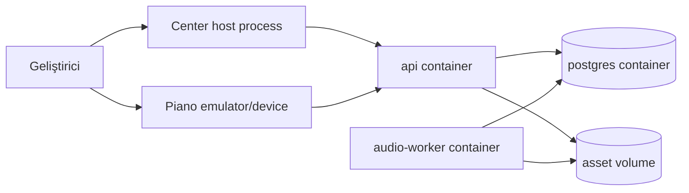

# Docker ve yerel geliştirme

Durum: Öneri

## Kapsam

Docker, backend bağımlılıklarını ve tekrar üretilebilir geliştirme ortamını çalıştırır. Tauri desktop GUI ve React Native mobil uygulama container içinde çalıştırılmaz.

## MVP Compose servisleri



### Servisler

| Servis         | Amaç                                      | Dış port | Kalıcı volume   |
| -------------- | ----------------------------------------- | -------: | --------------- |
| `postgres`     | Metadata ve job queue                     |   `5432` | `postgres-data` |
| `api`          | HTTP API                                  |   `3000` | `asset-data`    |
| `audio-worker` | Analiz ve render                          |      Yok | `asset-data`    |
| `mailpit`      | Geliştirme e-postaları, opsiyonel profile |   `8025` | Yok             |

İleride `object-storage` profili S3 uyumlu bir servis ekleyebilir. Varsayılan geliştirme local filesystem adapter kullanır.

## Planlanan dosyalar

```text
compose.yaml
compose.dev.yaml
.env.example
infrastructure/docker/
├── api.Dockerfile
├── audio-worker.Dockerfile
├── postgres/
│   └── init.sql
└── scripts/
    └── healthcheck.sh
```

## Ağ ve volume

- Tek internal network: `stemweave-network`
- API dışındaki servisler gereksiz yere host’a açılmaz.
- PostgreSQL geliştirme kolaylığı için yalnızca localhost’a bind edilir.
- `asset-data` API ve worker arasında paylaşılır.
- Production’da paylaşılan volume yerine object storage adapter kullanılır.

## Ortam değişkenleri

```text
NODE_ENV=development
DATABASE_URL=postgresql://...
ASSET_STORAGE_DRIVER=local
ASSET_LOCAL_ROOT=/data/assets
PUBLIC_API_URL=http://localhost:3000
AUTH_DRIVER=development
LOG_LEVEL=info
FFMPEG_PATH=/usr/bin/ffmpeg
FFPROBE_PATH=/usr/bin/ffprobe
```

Gerçek `.env` commit edilmez. `.env.example` yalnızca sahte ve güvenli değerler içerir.

## Sağlık kontrolleri

- `postgres`: `pg_isready`
- `api`: `GET /health/live` ve `GET /health/ready`
- `worker`: heartbeat kaydı ve son claimed job zamanı
- API readiness, migration tamamlanmadan başarılı dönmez.

## Adım adım yerel başlangıç hedefi

Repo oluşturulduğunda hedef komutlar:

```bash
corepack enable
pnpm install
docker compose up -d postgres
pnpm db:migrate
pnpm dev:api
pnpm dev:center
pnpm dev:piano
```

Bu komutlar henüz uygulanmış değildir; `M1 Project Contract` aşamasında oluşturulacaktır.

## Container güvenliği

1. Uygulama root olmayan kullanıcıyla çalışır.
2. Runtime image minimal tutulur.
3. Source map ve development araçları production image’a girmez.
4. Image digest veya belirli sürüm pinlenir; `latest` kullanılmaz.
5. Secrets image layer’a yazılmaz.
6. Asset klasörü execute izni olmadan mount edilir.
7. FFmpeg input süresi, boyutu ve process timeout’u sınırlandırılır.
8. Container SBOM ve vulnerability scan release sırasında üretilir.

## Docker Desktop maliyet notu

Docker Compose tanımı ücretsiz ve taşınabilir araçları hedefler. Docker Desktop’ın ticari kullanım koşulları organizasyon büyüklüğüne göre değişebilir. Alternatif uyumlu runtime kullanımı desteklenmelidir.

## Production yaklaşımı

İlk public alpha tek sunucuda Compose ile çalışabilir. Kullanıcı ve yük arttığında yönetilen PostgreSQL, object storage ve bağımsız worker deployment’a geçiş yapılır. Kubernetes MVP gereksinimi değildir.
