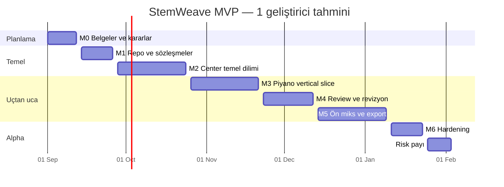

# Yol haritası ve zaman tahmini

Durum: Öneri

## Tahmin varsayımları

- Başlangıç: 1 Eylül 2026
- Ekip: 1 tam zamanlı deneyimli geliştirici
- Tasarım ve ürün kararlarında kullanıcı haftalık geri bildirim verir.
- Hazır sample lisansı bulunur; özgün piyano sample kaydı takvime dahil değildir.
- App Store/Google Play yayın onayı public alpha takvimine dahil değildir.
- Profesyonel mix/mastering motoru MVP dışıdır.

Bu koşullarda çalışan public alpha için **18 hafta + 2 hafta risk payı** öngörülür. Tahmini bitiş aralığı **19 Ocak–2 Şubat 2027**’dir. Tek geliştirici yarı zamanlı çalışırsa süre yaklaşık 30–36 haftaya çıkabilir.

## Fazlar

| Faz                      | Tarih          |      Süre | Çıktı                                             |
| ------------------------ | -------------- | --------: | ------------------------------------------------- |
| M0 Belge ve karar tabanı | 1–11 Eyl 2026  |   2 hafta | Gereksinimler, mimari, şema, backlog              |
| M1 Repo ve sözleşmeler   | 14–25 Eyl      |   2 hafta | Monorepo, CI, ProjectManifest, Compose/Postgres   |
| M2 Center temel dilimi   | 28 Eyl–23 Eki  |   4 hafta | Proje oluşturma, roller, gelenler, timeline shell |
| M3 Piyano vertical slice | 26 Eki–20 Kas  |   4 hafta | Metronom, MIDI kayıt, preview, upload             |
| M4 Review ve revizyon    | 23 Kas–11 Ara  |   3 hafta | Yorum, görev, revision, A/B, merge                |
| M5 Ön miks/export        | 14 Ara–8 Oca   |   3 hafta | Worker, WAV render, release candidate             |
| M6 Hardening ve alpha    | 11–22 Oca 2027 |   2 hafta | Güvenlik, performans, paketleme, doküman          |
| Risk payı                | 25 Oca–2 Şub   | 1–2 hafta | Audio/device ve packaging sorunları               |

## Zaman çizelgesi

## Milestone çıkış kriterleri

### M0

- Açık soruların sahibi ve tarihi vardır.
- İsim geçici veya kesin olarak işaretlenmiştir.
- MVP dışı maddeler kabul edilmiştir.

### M1

- Temiz checkout CI’da kurulur.
- Migration boş PostgreSQL’e uygulanır.
- ProjectManifest contract testi geçer.

### M2

- Şef proje oluşturur.
- BPM/ölçü kilidi görünür.
- Timeline pan, scroll, marker ve panel toggle çalışır.

### M3

- Gerçek cihazda piyano latency hedefi ölçülür.
- Dört ölçü kayıt Center’da görünür.
- Yanlış rule version sunucuda reddedilir.

### M4

- Zaman kodlu yorum ve notification çalışır.
- İkinci revision ilk revision’a bağlanır.
- Merge aktif revision’ı değiştirir, kaynağı silmez.

### M5

- Render snapshot tekrar üretilebilir.
- Stereo WAV checksum ile kaydedilir.
- Başarısız job güvenli biçimde yeniden denenir.

### M6

- macOS ve Windows smoke test geçer.
- Güvenlik checklist’i tamamlanır.
- Katkı rehberi ve issue template’leri hazırdır.
- Alpha release notu yayımlanabilir durumdadır.

## En büyük takvim riskleri

1. Mobil audio latency ve polyphony
2. Tauri webview’lerinde tutarlı Web Audio davranışı
3. WAV/FLAC codec ve FFmpeg dağıtım lisansı
4. Büyük upload’ların zayıf bağlantıda yeniden denenmesi
5. Timeline undo/redo ve commit modelinin gereğinden erken karmaşıklaşması
6. Tek geliştiricinin mobil, desktop ve backend bağlam değiştirmesi

## Takvim kontrol ritmi

- Pazartesi: haftalık hedef ve risk kontrolü
- Çarşamba: çalışan dikey dilim demosu
- Cuma: kabul kriteri, belge ve backlog güncellemesi
- Her milestone sonunda tahmin yeniden hesaplanır; tarih sessizce değiştirilmez.
