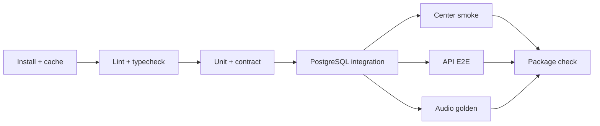

# Test, güvenlik ve gözlemlenebilirlik

Durum: Öneri

## Test stratejisi

### Unit test

- BPM ve ölçü doğrulama
- Tick/ölçü/piksel dönüşümleri
- Rol policy’leri
- Contribution state machine
- Revision state machine
- Tempo request kararları
- Audio render planı oluşturma

### Contract test

- ProjectManifest fixture’ları
- ContributionManifest fixture’ları
- API OpenAPI uyumu
- Center–API ve Piano–API geriye uyumluluk

### Integration test

- PostgreSQL migration
- Transaction ve optimistic locking
- Asset storage adapter
- Job claim/retry
- RBAC endpoint’leri
- Audit event üretimi

### Uçtan uca test

1. Proje oluştur
2. Müzisyen davet et
3. Piyano manifestini al
4. Fixture contribution yükle
5. Timeline’a ekle ve taşı
6. Yorum ve revision oluştur
7. Merge et
8. WAV render et

### Audio golden test

- Küçük, lisansı açık PCM fixture’lar kullanılır.
- Çıktı checksum’ı platforma göre kararsızsa PCM sample toleransı karşılaştırılır.
- Peak, duration, sample rate ve channel count doğrulanır.
- Sessizlik, clipping ve offset hataları kontrol edilir.

### Performans testleri

- 50 track / 500 clip timeline
- 1 GB resumable upload sonraya bırakılabilir; MVP limiti daha düşük belirlenir.
- 10 dakikalık WAV render
- 20 eşzamanlı background job
- Mobil 10+ note polyphony ve sustain

## CI test aşamaları

## Güvenlik tehditleri ve kontroller

| Tehdit                 | Kontrol                                                    |
| ---------------------- | ---------------------------------------------------------- |
| Yetkisiz proje erişimi | Proje bazlı RBAC ve object-level authorization             |
| Sahte dosya türü       | Magic-byte/ffprobe doğrulaması; MIME tek başına güvenilmez |
| Zararlı/bozuk media    | İzole worker, timeout, boyut ve kaynak limitleri           |
| Path traversal         | Storage key sunucu üretir; kullanıcı path’i kullanılmaz    |
| Checksum değişikliği   | SHA-256 doğrulama                                          |
| Tekrarlı mutation      | Idempotency key                                            |
| Token sızıntısı        | Secure storage, kısa ömür, log redaction                   |
| XSS/yorum içeriği      | Markdown allowlist ve HTML sanitize                        |
| SQL injection          | Parametreli sorgu ve ORM; raw SQL review                   |
| SSRF                   | Kullanıcı tarafından verilen URL’den server-side fetch yok |
| Supply-chain           | Lockfile, dependency review, SBOM, pinned actions          |
| Yetkisiz merge         | API policy + transaction + audit                           |

## Gizlilik

- Ham kayıtlar varsayılan olarak proje üyelerine özeldir.
- Viewer taslak asset URL’si alamaz.
- Storage URL’leri kısa ömürlü veya authenticated endpoint üzerinden sunulur.
- Kullanıcı export ve hesap silme akışı public alpha öncesi tamamlanır.
- Telemetry varsayılan olarak minimum ve açıkça belgelenmiş olur.
- Loglarda e-posta gerektiğinde hash/pseudonym uygulanır.

## Gözlemlenebilirlik

### Log

- JSON structured log
- `request_id`, `user_id` (güvenli/pseudonym), `project_id`, `job_id`
- Domain event adı ve süre
- Dosya içeriği, auth token ve parola loglanmaz

### Metric

- HTTP request rate/error/duration
- Upload success/failure/bytes
- Job queue depth ve oldest job age
- Audio job duration/failure
- Render duration per minute of audio
- Timeline save conflict sayısı
- Notification delivery failure

### Trace

İlk MVP’de request ID yeterlidir. Public alpha sonrasında OpenTelemetry adapter eklenebilir.

## Hata bütçesi hedefleri

- API local development smoke: %99 başarılı test koşusu
- Asset checksum doğrulaması: başarısız dosyada sessiz kabul yok
- Render job: geçici hatada en fazla 3 otomatik deneme
- Veri kaybı: kabul edilemez; DB transaction ve asset state ayrımı zorunlu

## Güvenlik release checklist

- [ ] Secrets tarandı.
- [ ] Dependency açıkları incelendi.
- [ ] Container root olmayan kullanıcıyla çalışıyor.
- [ ] FFmpeg build/lisans notu oluşturuldu.
- [ ] RBAC negatif testleri geçti.
- [ ] Upload limitleri doğrulandı.
- [ ] Backup/restore denendi.
- [ ] SECURITY.md iletişim yolu çalışıyor.
- [ ] Log redaction testi geçti.
